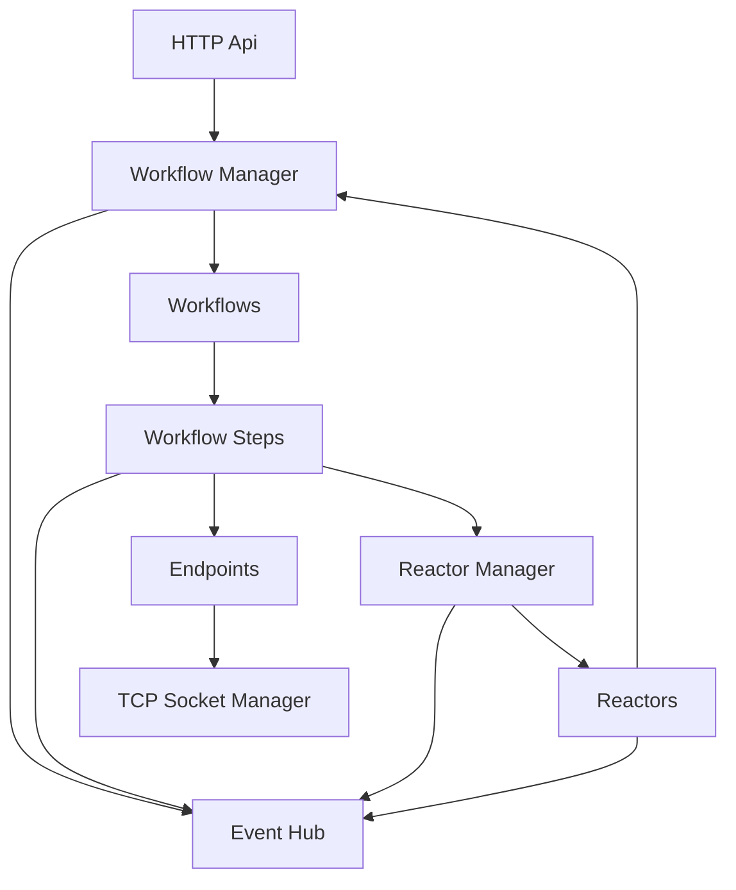

# Architecture

Mmids is built in the Rust programming language.  There are two main projects that are relevant to developers:

* `mmids-app` contains the code that the official mmids distribution is built from.  It is a good starting point for developers to see how all the components can be used together.
* `mmids-core` is the crate that contains the bulk of the logic and systems that mmids deploys.  It is available on crates.io as a library TODO: add link.

The code heavily relies on the [tokio asynchronous runtime](https://tokio.rs).

## Components

Almost every component that makes up mmids s designed to be independent asynchronous actors.  Each actor manages it's own state and different actors only talk to each other through message channels (usually `UnboundedSender<T>` channels).  

Replacing (or mocking) any component is usually a matter of creating custom code that can respond to incoming messages to the channel.



### Endpoints

Endpoints are actors which are abstract external communications for workflow steps.  Most networking protocols and external system communication that would be shared between different workflow steps would be implemented as their own endpoints.  This keeps the logic of workflow steps focused on the business logic for processing media, and the complexities of network protocols and process handling in a centralized location.  For example, implementing an SRT server, creating HLS playlists, or managing outbound RTMP connections would all be implemented as endpoints.

Mmids officially implements two endpoints:
* Rtmp Server Endpoint - Allows opening ports and managing incoming RTMP client connection based on instructions by workflow steps.  It handles managing the RTMP sessions, passing media it receives to the proper workflow steps, and receiving media from workflow steps and giving it to RTMP publish clients.
* Ffmpeg endpoint - Allows creating ffmpeg processes with specific parameters, restarting the processes if they unexpectedly shut down, and shutting them down as requested.


### Workflow Manager

The workflow manager is a central actor which holds a reference to all running workflows.  Requests to start, stop, or update workflows usually goes to the workflow manager, as it's unlikely other components have a direct reference to the different workflow specific messaging channels.  The workflow manager is also in charge of knowing when a workflow needs to be started and when an existing one needs to be updated instead.

It is expected that any mmids system only has one workflow manager, as one workflow manager won't necessarily know about the workflows managed by the other.  This can lead to some complicated scenarios, especially when workflow started events start being raised (e.g. other systems won't know which workflow manager to contact about a workflow).

The workflow manager is started by calling the `mmids_core::workflows::manager::start_workflow_manager()` function.

### Workflows

A workflow actor is started by the workflow manager by passing in a `WorkflowDefinition` value.  This definition contains instructions for the workflow on what steps it should maintain.  The workflow will create the workflow steps that are contained in the workflow definition and place them in pending status.  Once all pending workflow steps change their state to active, all pending steps become active steps and the workflow will start flowing media from one step to the next.  

If a workflow step ever transitions to an error state, the whole workflow will transition to an error state and all workflow steps will be shut down.  The workflow will be restarted if it receives a request to update with a new workflow definition.

### Workflow Steps

Workflow steps are the only components that are **not asynchronous**.  They are meant to be called synchronously by a workflow.  If a workflow step requires an asynchronous action, it will create a boxed future with the asynchronous operation and return it as an output.  The workflow that is in charge of hte step will track the future, and once the future has completed the result will be passed as an input to the workflow step.  

All workflow steps are expected to create an `enum` which represents the results of any future that the workflow step will need completed.  This enum should implement the `StepFutureResult` trait, which allows the enum to be casted down from a `StepFutureResult` into the step specific enum.  

### Reactor Manager

The reactor manager is a central actor which keeps references and manages all known reactors.  When a workflow step needs to make a request to a specific reactor, it reaches out to the reactor manager to send the reques to the correct reactor.

It is expected that only one reactor manager is active. 

The reactor manager is started by calling the `mmids_core::reactors::manager::start_reactor_manager()` function.

### Reactors

Each reactor is a separate actor which knows how to communicate with a single external system.  When it executes a query for a stream name, and the external system responds with some workflows, the reactor will ensure that the workflows it created are shut down when the stream is over.  If the reactor has been set with an update interval, it will continually re-execute queries against the external system for the stream name to ensure it's always managing the latest versions of the workflow that are expected for that stream.

Each reactor contains a Reactor Executor, which is a `struct` that implements the `mmids_core::reactors::executors::ReactorExecutor` trait.  The executor object is responsible for actually performing requests to the external systems on behalf of the reactor.  Mmids only officially supports a `simple_http` executor, which is documented [in the reactor section](../user-guide/reactors.md).

When implementing a custom executor, the executor itself should handle retries as it sees fit, as the reactor has no retry logic in it.  Either the executor returns a result that says it's valid, or a result that says it's invalid.

### Event Hub

Event hub is a central actor that allows components to subscribe to events, and publish their own events.  Currently this is mostly used for a workflow manager to raise a notification when it goes live (so the reactor manager knows how to contact it), and when workflows start and stop (so workflow forwarders know how to forward media to different workflows).  

It is expected that only a single event hub actor is running at any given time.

### HTTP API

Mmids uses [hyper](https://hyper.rs/) to power its HTTP API.  The core library does not do any routing, but instead it defines the `mmids_core::http_api::routing::RouteHandler` trait.  Each implementation of a route handler represents a single set of logic that should be used to resolve a web request.  Route handlers utilize the [async_trait crate](https://crates.io/crates/async-trait) to provide an async return type.

To utilize these routes, a `mmids_core::http_api::routing::RoutingTable` is created and route handler instances are registered with it for specific url paths.  This allows for libraries to contain the route handlers logic in a central place, but allowing the final distribution to figure out what urls and HTTP methods should expose which route handlers (and which should not be enabled).

This isn't a perfect abstraction though.  Route URLs are defined as a `Vec` of `PathPart` values, where some path parts are representing a parameter instead of a strict value.  So for example, `/workflows/<name>` woulc be built as 
```rust
vec![
    PathPart::Exact {
        value: "workflows".to_string(),
    },
    PathPart::Parameter {
        name: "workflow".to_string(),
    },
]
```

This specifies that the 2nd value is a parameter named `workflow`, and the route handler will be looking for a path parameter with that exact name.  So any URL that this route handler is tied to *must* have at least one path part as a parameter named `workflow`.

### TCP Socket Manager

The TCP socket manager is an actor to abstract the handling of TCP listeners.  Systems can request that ports be opened for raw TCP connections or TLS connections, and it will handle letting the caller know when any connections connect.  

