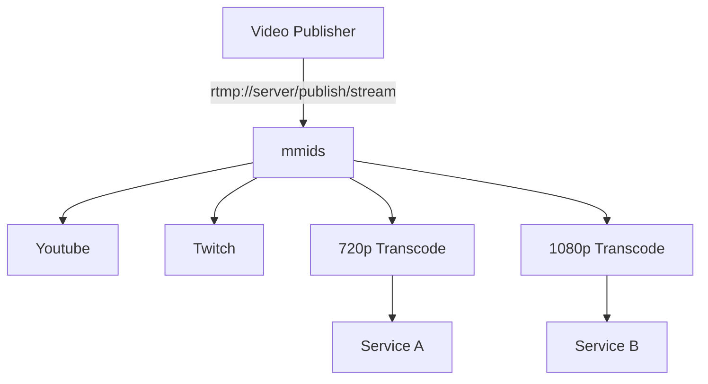

# Complex Multi-Streaming

In this scenario, a publisher wishes to send in video.  The raw video should be sent to Youtube and Twitch as-is (to let them do their own transcoding), but we want to send a 720p feed to service A and 1080p feed to service B.



This can be accomplished with the following configuration: 

```
workflow ingest {
    rtmp_receive rtmp_app=publish stream_key=stream
    workflow_forwarder target_workflow=transcode_720
    workflow_forwarder target_workflow=transcode_1080
    ffmpeg_push target=rtmp://a.rtmp.youtube.com/live2/some_yt_key
    ffmpeg_push target=rtmp://live.twitch.tv/app/some_twitch_key
}

workflow transcode_720 {
    ffmpeg_transcode vcodec=h264 acodec=copy size=1280x720 bitrate=2500
    ffmpeg_push target=rtmp://service_a/app/some_key
}

workflow transcode_1080 {
    ffmpeg_transcode vcodec=h264 acodec=copy size=1920x1080 bitrate=4000
    ffmpeg_push target=rtmp//service_b/app/some_key
}
```
