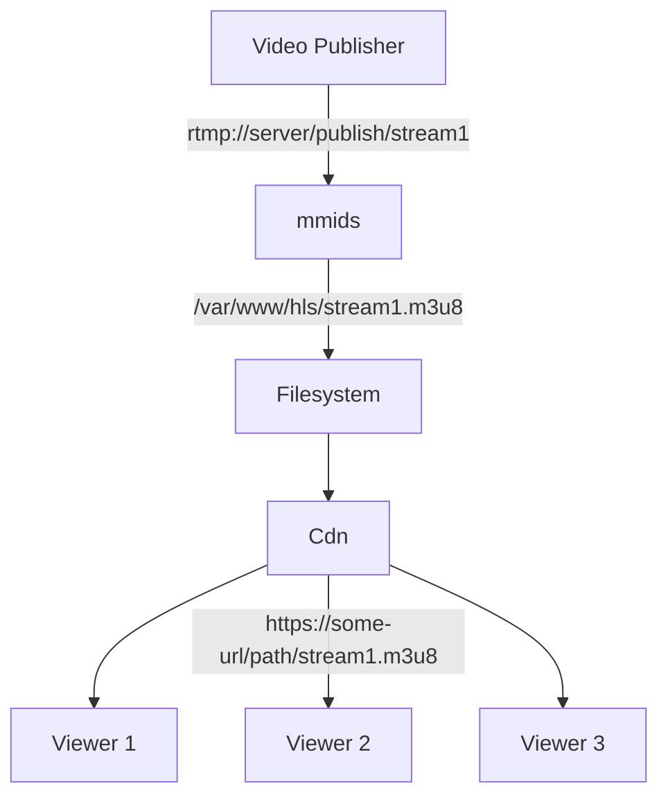

# HLS Publishing

In this scenario we want publishers to be able to send video via RTMP into a mmids instance, and a CDN serve the created HLS feeds to viewers.



This can be accomplished with the following configuration:

```
workflow hls {
    rtmp_receive rtmp_app=publis stream_key=*
    ffmpeg_hls path=/var/www/hls duration=2 count=5
}
```
