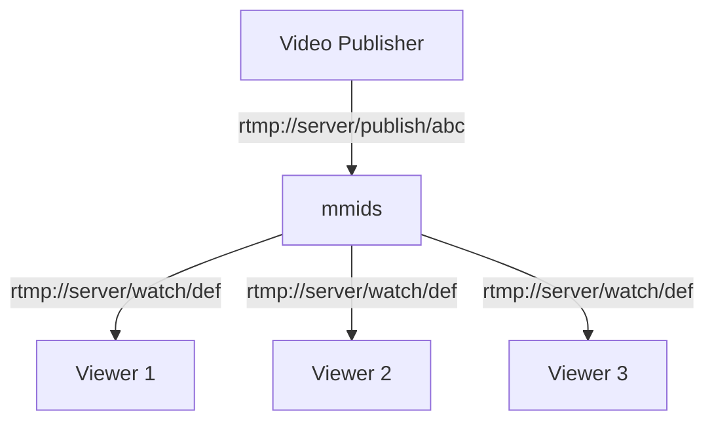

## Restricted Publish / Playback By Stream Key

In this scenario, we want to only allow one specific stream key to receive video.  We want viewers to be able to connect and watch the stream, however we do not want viewers to know the stream key used to publish video (so others can't publish video as the publisher).  Thus the publishing stream key is different than the watching stream key.



This is achieved with the following configuration

```
workflow restricted {
  rtmp_receive rtmp_app=publish stream_key=abc
  rtmp_watch rtmp_app=watch stream_key=def
}
```

