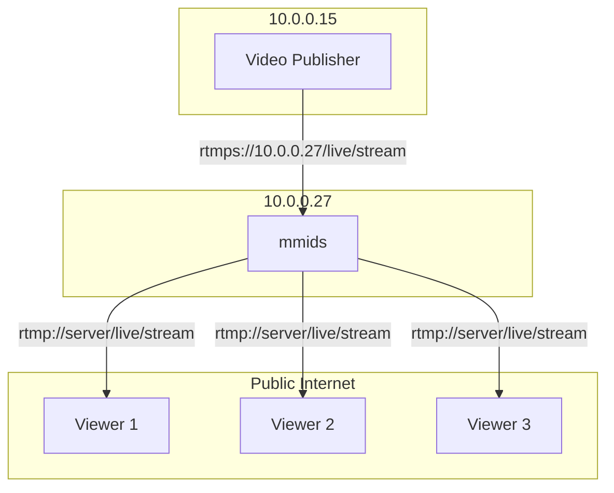

# Network Restricted Publishing

In this scenario, we only want to allow publishers from within the local intranet, and only on RTMPS.  RTMP viewers are unrestricted.



This can be done with the following configuration:

```
workflow network_publish {
    rtmp_receive rtmp_app=live stream_key=* rtmps allow_ips=10.0.0.0/24
    rtmp_watch rtmp_app=live stream_key=*
}
```

