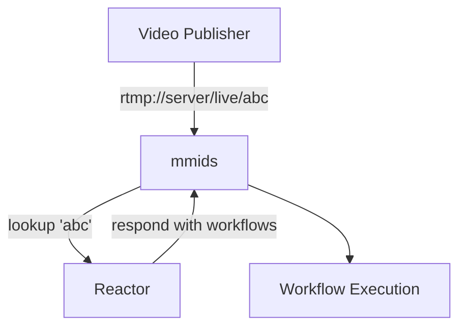

# Per Publisher Workflows

In this scenario, each publisher might require a different workflows.  Some might require transcoding, some might require being pushed into specific RMTP endpoints, some should not be allowed to push in video at all.



The configuration for this is:

```
reactor lookup executor=simple_http update_interval=60 {
    url https://lookup-server/query
}

workflow receiver {
    rtmp_receive rtmp_app=live stream_key=* reactor=lookup
    workflow_forwarder reactor=lookup
}
```

!!! note

    This assumes a web server is setup as a reactor at `https://lookup-server` that can respond to `/query` requests.

When a publisher requests to publish to the server on a specific stream key, that stream key will be passed in a `PUT` request to `https://lookup-server/query`, wiht the stream key as the requests body.  

If the stream key is not allowed the lookup server will respond with a `404`, causing the `rtmp_receive` step to disconnect the publisher.

If the stream key is allowed, mmids will create the workflows returned by the lookup server, and the `workflow_forwarder` step will forward the publisher's media stream to those workflows.
