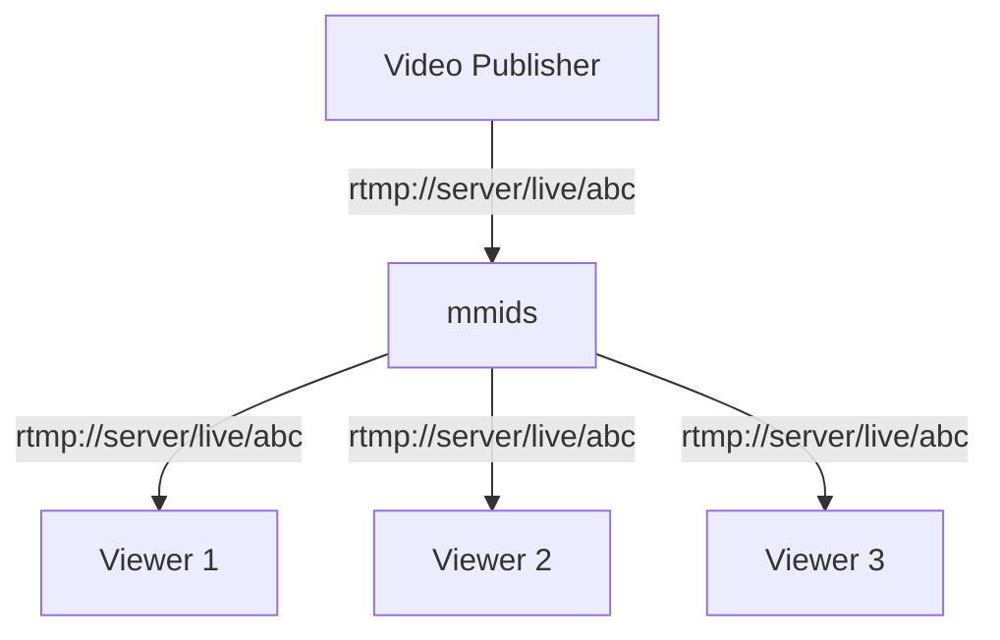

# Simple Publish / Playback

In this scenario, it is desired to have RTMP publishers send in video on any stream key, and any RTMP clients are allowed to watch those stream.  No transformation of video is desired.



This is achieved with the following configuration

```
workflow simple {
  rtmp_receive rtmp_app=live stream_key=*
  rtmp_watch rtmp_app=live stream_key=*
}
```