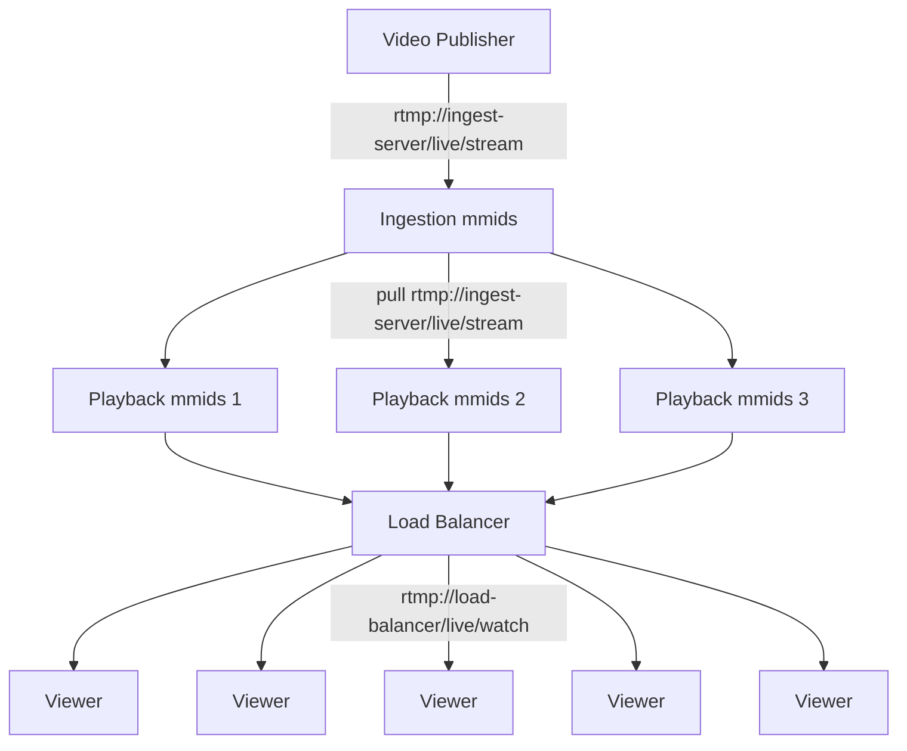

# Simple RTMP Load Balancing

In this scenario we want to serve many RMTP clients for a single stream, but don't want to overload the ingestion server.  We want to be able to add new playback nodes on-demand.



The configuration for the ingestion mmids instance would be:

```
workflow ingestion {
    rtmp_receive rtmp_app=live stream_key=stream
    rtmp_watch rtmp_app=live stream_key=stream
}
```

The configuration for each playback mmids instance would be:

```
workflow playback {
    ffmpeg_pull location=rtmp://ingest-server/live/stream stream_name=watch
    rtmp_watch rtmp_app=live stream_key=watch
}
```

