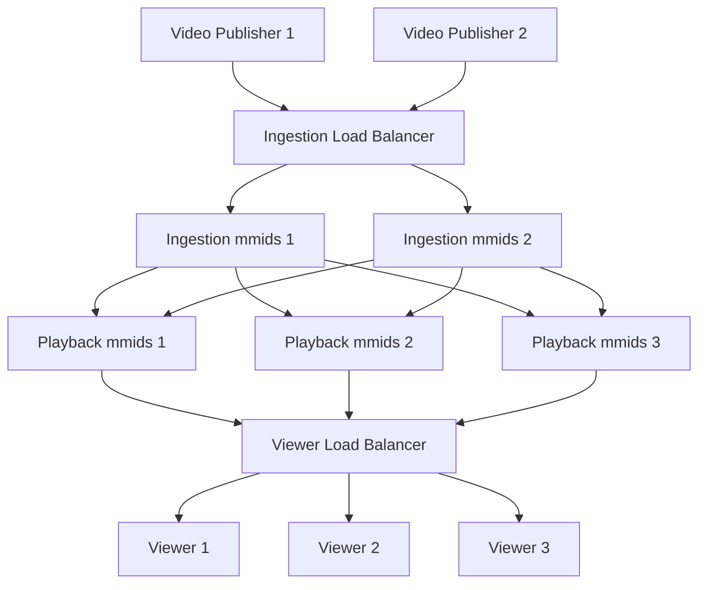

# Dynamic RTMP Load Balancing

In this scenario we have a set of ingestion mmids instances and a set of playback mmids instances, with each set being able to independently scale.

Video publishers should be able to publish to any ingestion instance with any stream key, and any playback client should be able to any playback instance.

A playback instance should only pull an video stream if there is at least one playback connected on that instance, and it should pull from the correct ingestion instance.



To achieve this, the ingestion instances need to be configured with:

```
reactor publishers executor=simple_http update_interval=60 {
    url: https://web-server/publisher_lookup
}

workflow ingestion {
    rtmp_receive rtmp_app=ingest stream_key=* reactor=publishers
    rtmp_watch rtmp_app=pull_source stream_key=*
}
```

The playback instances need to be configured with:

```
reactor watchers executor=simple_http update_interval=60 {
    url: https://web-server/watcher_lookup
}

workflow pending_watchers {
    rtmp_watch rtmp_app=live stream_key=*
}
```

The web server handling reactor requests need to be custom coded with logic to handle both `/publisher_lookup` and `/watcher_lookup` calls.

When `/publisher_lookup` is called, write down in a cache the ip address the HTTP request came in from.  This lets us know which ip address the feed is coming in from.  Once that's done we should respond with a `200` but no workflow definitions (since no additional functionality is needed from the ingestion instances).

When `/watcher_lookup` is called, look up the stream name from the cache.  If it's not in the cache (e.g. `/publisher_lookup` wasn't called for this stream) then return a `404`.  If the stream name is in the cache, return a `200` with a workflow defined as:

```
workflow ingest_<stream_name> {
    ffmpeg_pull location=rtmp://<ip_address>/pull_source/<stream_name> stream_name=<stream_name>
}
```

where `<stream_name>` is replaced with the name of the stream in the HTTP request, and `<ip_address>` was the cached IP address for the ingestion node that is being published to.


